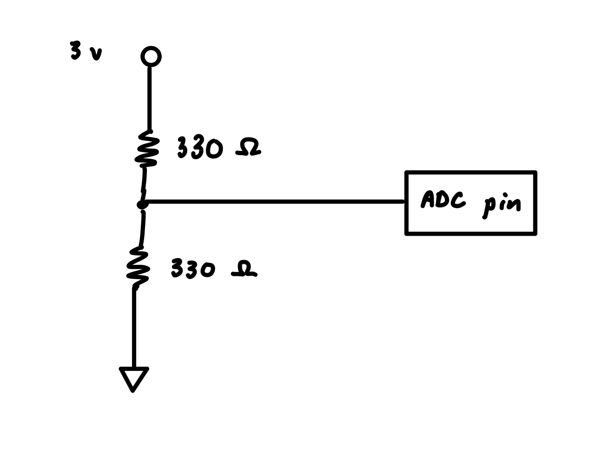
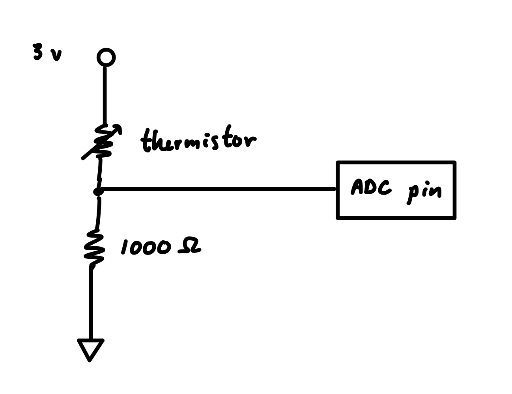
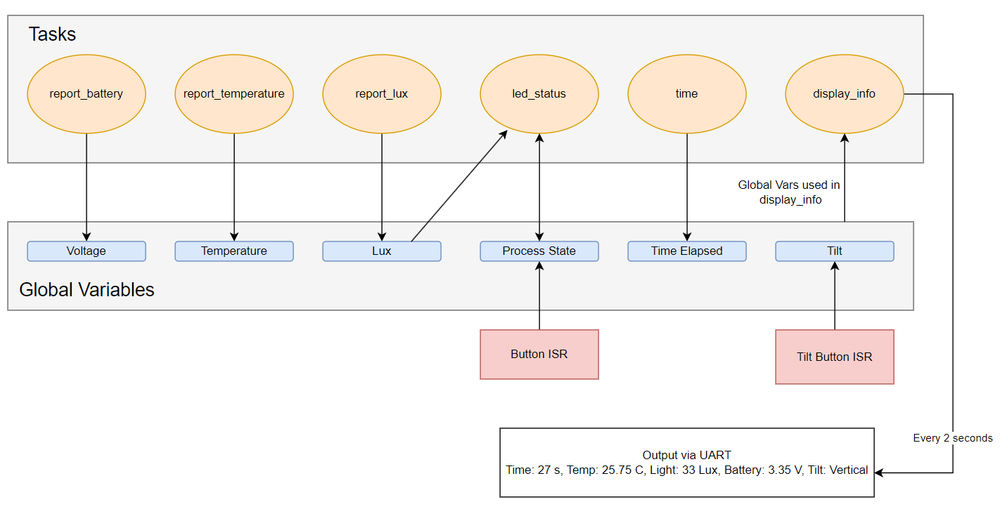
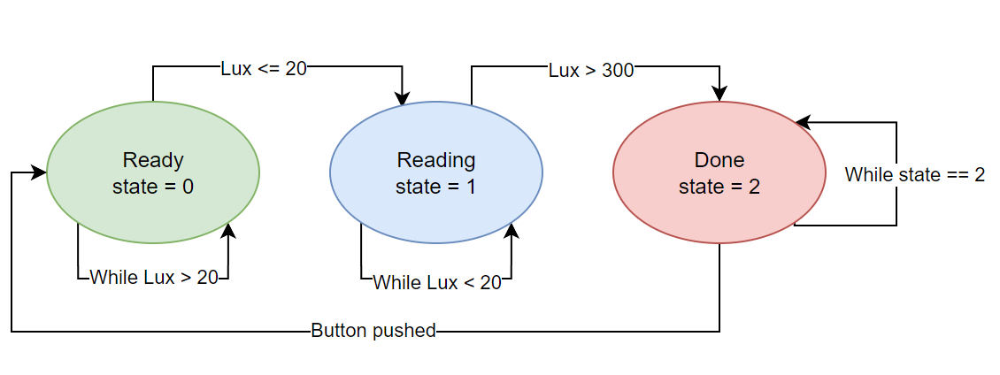

# Ingestible "Smart Pill"

Authors: Cristian Palencia, Yohank Kim, Zhiang Gui, Tanveer Dhilon

Date: 2024-09-20

### Summary
This project was about creating a ingestible smart pill that would display over UART a set of relevant data. This data would include data about the current temperature, battery of the pill, time duration, light readings, and orientation. The purpose would be that we would be able to monitor the values under 3 conditions: 1. when the pill has not been swallowed, 2. when the pill has been swallowed, and 3. when the pill has left the body. These 3 conditions would be displayed via 3 LEDs, green meaning that the pill was ready to be swallowed, blue meaning that the pill has been swallowed and is inside the body, and red meaning that the pill has left the body. Additional, in the need for a reset, we would have a button that would reset the state that the LEDs were in and also resetting the time elapsed in the program.

In order to get the quest to work we had several implementations:

#### 1. Battery Indicator
In order to get the battery indicator to work we had to set up a voltage divider circuit. This was implemented in order to read in a 3.3 V input from the ESP32. The voltage divider ensures that when we go to read this input that we aren't supplying more to the GPIO pin that it can handle. Using a voltage divider that splits the voltage in half (two 330 Ohm resistors) we can ensure that we would at most read a ~3.3/2 reading. We can then use an ADC GPIO pin to read in the analog reading from the voltage divider. Once we read the analog reading we can convert it to an actual voltage reading that is usable as a battery indicator.

#### 2. Thermistor 
To properly read the external temperature we implemented another voltage divider circuit but it now incorporates a thermistor. The thermistor functions by changing resistance as the temperature changes. Thus, if we set up a voltage divider with a known input voltage (in this case 3.3V) and a measured analog reading (using another ADC GPIO pin), we can properly solve for the variable resistance of the thermistor and then convert that resistance into a temperature (in degrees C). We can solve for the variable resistance by using the equation for a voltage divider. Then using the computed resistance we can use Steinhart's equation to convert that into a usable temperature.  

#### 3. Photocell
We needed to implement a method to read in light values so that we could tell what state the pill was in: ready to be swallowed, currently swallowed, left the body. This again was implemented by using a voltage divider circuit. A photocell is also a variable resistor that changes based on amount of received light. We calibrated the photocell by reading the analog reading from the voltage divider. By obtaining the analog rearding at two different lux values we can create a descriptive linear equation for the current lux based on the analog voltage reading. In our case we took the voltage reading at no light (0 lux --> ~140mV) and then measured at regular light intensity (300 lux --> 1300 mV). With this, we can now convert any analog voltage reading into a converted light value in lux.

#### 4. LED Display and Button:
Three LEDs where implemented to show the status of the pill. A green LED is used to signal that the pill is ready to swallow, a blue LED is used to indicate normal sensing, and a red LED is used to indicate that the pill is done sensing. These 3 LEDs are directly controlled by a variable, process_states, to keep track of different states and also changed depending on the gobal lux value. The pill starts with the green LED (process_state 0) and once it gets dark enough (lux value is below 20), it switches to the blue LED (process state 1), then once it sees light again it switches to the red LED (process_state 2) and will continue to stay on red untill a button is pushed. The button is a hardware interrupt where it will reset the process_state back to 0 where it is ready to swallow again. 

#### 5. "Tilt" Sensor
For reasons covered in class we had to replace the original tilt sensor with a button that would simulate the tilt sensors behavior. We performed this by creating a interrupt request that would respond to a negative edge. The interrupt function would toggle a variable between 0 and 1 which would represent whether the pill was horizontal or vertical. 
 
#### 6. Data Display
The data display works via sending data from ESP32 to the laptop console via UART. Whenever we need to display data (every 2 seconds), our software would format a string with global variables that would represent sensor data: temperature, battery voltage, light reading, program time, and pill orientation. Once formatting the string using sprintf(), we would write the string over UART to the laptop console.

### Solution Design
Describe how you built your solution. Use hardware and software
diagrams, show data flow, include control flow or state charts if
appropriate.

Our solution is designed to monitor environmental and device-specific parameters such as temperature, light levels (lux), battery voltage, and device orientation using hardware interrupts and tasks in FreeRTOS.

#### Hardware Design
The system integrates several key sensors and components:

- Temperature sensor: Thermistor connected via ADC for temperature readings.
- Light sensor: A photocell connected through ADC for ambient light measurement.
- Battery sensor: An ADC input monitors the battery voltage.
- Tilt sensor: A tilt button is used to detect orientation changes.
- LEDs: Three LEDs (red, green, blue) provide visual feedback based on system state.

    
    
Voltage Divider for Battery Indicator

    
    
Voltage Divider for Photocell and Thermistor

#### Software Design
We implemented the solution using FreeRTOS, where each task focuses on a specific aspect of the system. Global variables store sensor readings and system state, which are then used by the display task to output data via UART.

#### Tasks
- report_temperature: Reads temperature values using the ADC, calculates the temperature from thermistor resistance, and updates the global Temperature variable.
- report_lux: Continuously samples the light sensor and converts voltage readings to lux values, updating the global lux variable.
- report_battery: Samples battery voltage and updates the global final_voltage.
- led_status: Based on the process_state, this task controls the LEDs, indicating the system's status (ready, sensing, or done).
- time: Increments the time_elapsed global variable to track the time since the last button press.
display_info: Every 2 seconds, this task collects updated global variables (temperature, lux, - battery, and tilt state) and outputs the information via UART.

#### Interrupts
- Button ISR: A hardware interrupt is triggered when the button is pressed, resetting the process_state and time_elapsed.
- Tilt Button ISR: Detects changes in device orientation and toggles the tilt state between vertical and horizontal, updating the tilt variable accordingly.

#### Data Flow and Output
Sensor tasks update the global variables based on their specific sensor readings. These variables are used by the display_info task to format the data into a UART output every 2 seconds, providing real-time status updates on temperature, light, battery voltage, and tilt orientation.

Code Flow Chart: Shows the relationship between tasks, global variables, and hardware interrupts

State Diagram of LED Display

### Project Summary
The "Smart Pill" tracks temperature, light, battery, and orientation as it moves through the body, using LEDs to show its state (ready, swallowed, or exited). It sends data every 2 seconds via UART and can be reset for reuse. Challenges included sensor calibration and interrupt-driven state management. Another challenge was keeping wires organized while building the circuit and using the tilt sensor. We used voltage dividers for safe battery and temperature readings, while the photocell was calibrated to detect light changes and adjust the pill's state. Interrupts controlled the tilt sensor and LEDs, ensuring accurate tracking of the pill’s position and status.

### Supporting Artifacts
- Link to video technical presentation: [Technical Presentation](https://drive.google.com/file/d/1WAg6dNmaZUGKDJ7yxstegLMrAWHKJhu-/view?usp=sharing)
- Link to video demo [video demo](https://drive.google.com/file/d/1Q0cmgKvMJzyynExxrp9cXvPJPhaWtwVe/view?usp=drive_link)

### AI and Open Source Code Assertions

- We have documented in our code readme.md and in our code any software that we have adopted from elsewhere
- We used AI for coding and this is documented in our code as indicated by comments "AI generated" 

